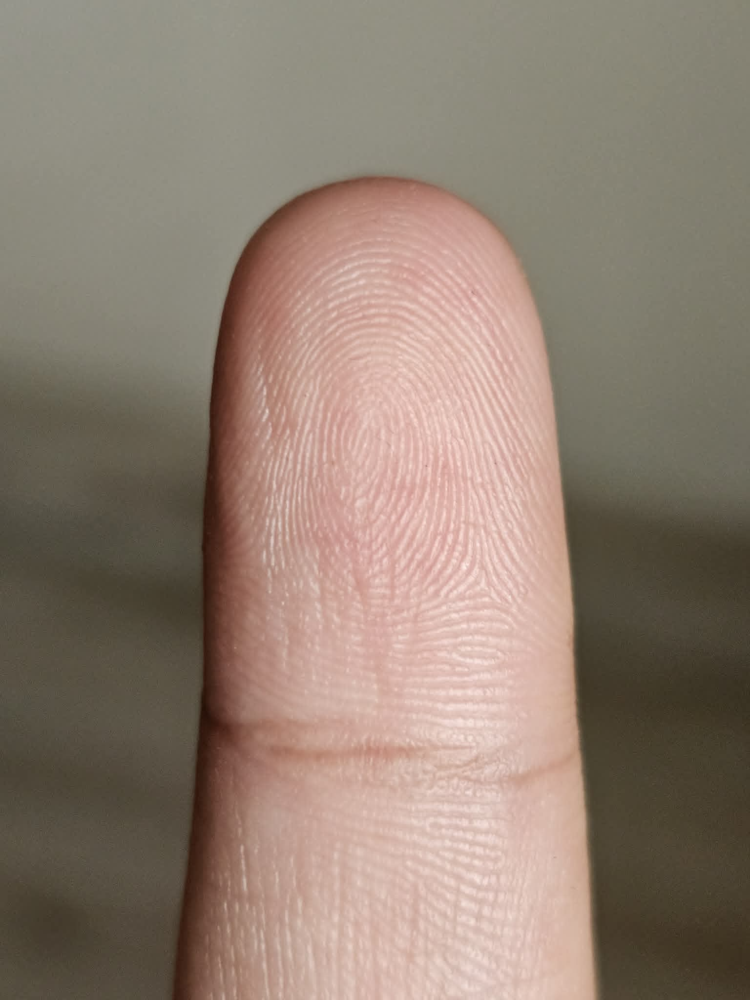
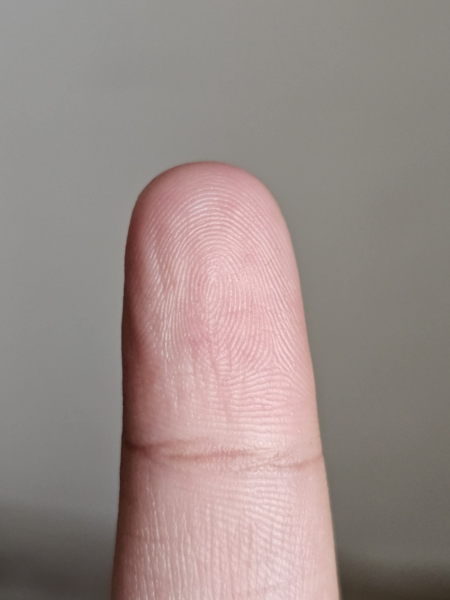

# Fingerprint Matching Pipeline Diagnostic Report

## Scope

This report summarizes the diagnostic experiments performed on the contactless fingerprint matching pipeline. The primary objective was to determine why two real captures of the same finger produce a relatively low genuine score even though synthetic shift/rotation tests show reasonable robustness.

Unless otherwise stated, experiments used:

| Setting | Value |
|---|---|
| Model weights | `weights/best.pt` |
| Matcher | `LSA-CENTROID` |
| Minutia threshold | `0.6` |
| NMS | on |
| Segmentation mode | `finger-pad-auto` |
| Device | CPU |

## Primary Captures

The main real same-finger pair used in the diagnosis is shown below.

| Capture A | Capture B |
|---|---|
|  |  |

## Experiment 1: Segmentation and Masking Failure

### Purpose

The first failure observed was that the old trusted path produced broken masks. The foreground/masked images removed or blacked out large parts of the finger pad, especially in one capture. This made downstream minutia extraction unreliable or impossible.

### Change Made

A new `finger-pad-auto` path was implemented for controlled contactless finger photos:

| Change | Result |
|---|---|
| Removed `rembg` from trusted inference path | Avoids generic foreground-removal failures |
| Added deterministic finger pad segmentation | Uses skin/geometry/ridge-energy cues |
| Added full-finger and distal-pad quality gates | Bad masks fail before FeatureNet/MCC |
| Added repair pass for background-connected masks | Handles warm background strips connected to finger |
| Added debug overlays and rejection artifacts | Makes segmentation failures inspectable |

### Indication

The original segmentation path was a major pipeline risk. The replacement made the pipeline fail-loud and produced usable masks for the controlled captures. However, later experiments show that even with improved masks, real same-finger captures still score low, so segmentation is not the only remaining failure.

## Experiment 2: Same-Image Determinism and Fixed-Period 5 px / 5 deg Diagnostics

### Purpose

Check whether FeatureNet and decoding are stable when the same image is reused, and then under tiny controlled transforms. Ridge-period scaling was fixed at `13.0846` to remove scale-estimation noise.

### Data

| Case | Input shape | Score-map shape | Raw active cells >=0.6 | Local maxima | Decoded NMS on | Decoded NMS off |
|---|---:|---:|---:|---:|---:|---:|
| base | `1565x1174` | `195x146` | `102` | `50` | `50` | `102` |
| same copy | `1565x1174` | `195x146` | `102` | `50` | `50` | `102` |
| shift x5 | `1565x1174` | `195x146` | `87` | `46` | `46` | `87` |
| rotate +5 deg | `1565x1174` | `195x146` | `119` | `53` | `53` | `119` |

| Comparison | NMS on within 8 px | NMS on within 16 px | NMS on within 24 px | NMS on within 32 px | NMS off within 16 px | Score-map correlation |
|---|---:|---:|---:|---:|---:|---:|
| same copy | `50/50` | `50/50` | `50/50` | `50/50` | `50/50` | `1.0000` |
| shift x5 | `34/50` | `36/50` | `39/50` | `43/50` | `36/50` | `0.9521` |
| rotate +5 deg | `12/50` | `34/50` | `42/50` | `47/50` | `35/50` | `0.6118` |

Failure categories:

| Comparison | Matched | Model score changed | Threshold drop | NMS suppressed | Offset moved | Orientation changed |
|---|---:|---:|---:|---:|---:|---:|
| same copy | `50` | `0` | `0` | `0` | `0` | `0` |
| shift x5 | `36` | `5` | `2` | `0` | `7` | `0` |
| rotate +5 deg | `31` | `1` | `2` | `1` | `12` | `3` |

### Indication

The same-image path is deterministic. Tiny transforms do change FeatureNet responses and localization, but NMS is not the primary cause. NMS-off does not recover most missing counterparts. The dominant instability is in score-map extraction and offset/orientation heads.

## Experiment 3: Same-Image MCC Robustness With Fixed Ridge Period

### Purpose

Measure whether the final MCC matcher remains robust when a single capture is synthetically shifted or rotated. This isolates matcher robustness from real capture variability.

### Data

| Transform | Minutiae | MCC score |
|---|---:|---:|
| same image | `50 -> 50` | `1.0000` |
| shift x10 | `50 -> 52` | `0.7744` |
| shift x15 | `50 -> 64` | `0.7408` |
| shift x20 | `50 -> 44` | `0.9358` |
| rotate +10 deg | `50 -> 54` | `0.7716` |
| rotate +15 deg | `50 -> 55` | `0.9456` |
| rotate +20 deg | `50 -> 54` | `0.8881` |

### Indication

The matcher is reasonably robust to synthetic transforms of the same capture. Scores are not monotonic: larger transforms sometimes score higher. This indicates branchy behavior in segmentation/preprocessing/FeatureNet extraction, but the final matcher does not collapse under these synthetic transforms.

The `shift x15` case produced `64` minutiae from a source that normally produced `50`. Inspection showed this was caused by a changed segmentation/preprocessing branch and a hotter FeatureNet score map, not by MCC or NMS.

## Experiment 4: Same-Image Combined Shift-Then-Rotate Sweep

### Purpose

Stress-test robustness when both translation and rotation are applied to the same capture before matching back to the original.

### Settings

| Setting | Value |
|---|---|
| Fixed ridge period | `13.0846` |
| Shifts | `x10` through `x50` |
| Rotations | `5, 10, 15, 20 deg` |
| Rotation canvas | same canvas |

### Data

| Shift | Rot 5 | Rot 10 | Rot 15 | Rot 20 |
|---:|---:|---:|---:|---:|
| x10 | `0.7894` | `0.7808` | `0.8786` | `0.9107` |
| x15 | `0.7607` | `0.7576` | `0.7949` | `0.7144` |
| x20 | `0.7690` | `0.7853` | `0.8484` | `0.8766` |
| x25 | `0.7350` | `0.7444` | `0.7571` | `0.7352` |
| x30 | `0.7965` | `0.7890` | `0.8388` | `0.8567` |
| x35 | `0.7690` | `0.7911` | `0.7611` | `0.7417` |
| x40 | `0.6958` | `0.7738` | `0.8246` | `0.8720` |
| x45 | `0.7324` | `0.7398` | `0.7505` | `0.7724` |
| x50 | `0.8075` | `0.7830` | `0.8091` | `0.8069` |

### Indication

The same-capture matcher remains robust under combined synthetic perturbations. This supports the conclusion that the low real-pair score is not simply a transform-invariance failure in MCC.

## Experiment 5: Real Pair With Transformed Probe Capture

### Purpose

Check whether the real same-finger pair maintains similar robustness when the second real capture is shifted and rotated before matching against the first real capture.

### Settings

Same as Experiment 4, except the transformed image is Capture B and the reference remains Capture A.

### Data

Baseline under fixed-period condition:

| Pair | Score | Minutiae |
|---|---:|---:|
| Capture A vs Capture B | `0.6167` | `50 -> 64` |

Combined transform scores:

| Shift | Rot 5 | Rot 10 | Rot 15 | Rot 20 |
|---:|---:|---:|---:|---:|
| x10 | `0.6333` | `0.5960` | `0.6300` | `0.5750` |
| x15 | `0.6488` | `0.6351` | `0.6534` | `0.6425` |
| x20 | `0.6260` | `0.5890` | `0.6108` | `0.6543` |
| x25 | `0.6331` | `0.6284` | `0.6530` | `0.6155` |
| x30 | `0.6230` | `0.5922` | `0.6368` | `0.6628` |
| x35 | `0.6394` | `0.6390` | `0.6535` | `0.6727` |
| x40 | `0.6034` | `0.5953` | `0.6124` | `0.6557` |
| x45 | `0.6501` | `0.6465` | `0.6611` | `0.6025` |
| x50 | `0.6219` | `0.6473` | `0.5979` | `0.6071` |

### Indication

The real pair scores remain clustered around `0.58-0.67` under synthetic transforms. That means the transform itself is not the main failure. The real pair already has mediocre correspondence before perturbation.

## Experiment 6: Forcing Capture B to Use Capture A Preprocessing Scalars

### Purpose

Test whether the real-pair score is low because Capture B estimates different preprocessing scalar values: ridge period, scale, and yaw.

### Data

| Run | Score | Minutiae |
|---|---:|---:|
| Normal Capture A vs normal Capture B | `0.6624` | `50 -> 54` |
| Normal Capture A vs Capture B forced to use Capture A scale/yaw | `0.5708` | `50 -> 56` |

Preprocessing values:

| Value | Capture A normal | Capture B normal | Capture B forced |
|---|---:|---:|---:|
| ridge period | `13.0846` | `12.0541` | `13.0846` |
| scale | `0.7643` | `0.8296` | `0.7643` |
| yaw | `-0.4448 deg` | `-2.5258 deg` | `-0.4448 deg` |

### Indication

Forcing Capture B to use Capture A preprocessing scalars made the score worse. Therefore, scale/yaw mismatch is not the primary reason this pair scores low.

## Experiment 7: Real Same-Finger Failure Waterfall

### Purpose

Diagnose exactly where correspondence collapses for the primary real pair.

### Data

Preprocessing and extraction:

| Image | Ridge period | Scale | Yaw | Shape | Mask area | BBox | Minutiae | MCC descriptors | Raw active cells | Local maxima |
|---|---:|---:|---:|---:|---:|---|---:|---:|---:|---:|
| Capture A | `13.0846` | `0.7643` | `-0.4448` | `1565x1174` | `411181` | `304,270,600,818` | `50` | `42` | `102` | `50` |
| Capture B | `12.0541` | `0.8296` | `-2.5258` | `1699x1274` | `388290` | `322,451,578,828` | `54` | `51` | `118` | `54` |

Alignment and MCC:

| Metric | Value |
|---|---:|
| Final MCC score | `0.6624` |
| Similarity matrix shape | `42 x 51` |
| LSA selected pairs | `12` |
| Counterparts within 16 px after diagnostic alignment | `5 / 50` |
| Counterparts within 32 px after diagnostic alignment | `16 / 50` |
| Median location error | `45.98 px` |
| Median angle error | `21.00 deg` |
| Score-map responses found | `17 / 50` |
| Pre-NMS candidates found | `17 / 50` |
| Survived NMS | `16 / 50` |
| Descriptor pairs available | `1057` |

Per-minutia failure categories:

| Failure category | Count |
|---|---:|
| `model_score_missing` | `31` |
| `offset_moved` | `11` |
| `descriptor_score_low` | `4` |
| `mcc_descriptor_dropped` | `1` |
| `nms_suppressed` | `1` |
| `matched` | `2` |

### Indication

The failure occurs mostly before MCC assignment. After diagnostic alignment, only `17/50` Capture A minutiae have a nearby score response in Capture B, and only `16/50` survive NMS. The dominant failure category is `model_score_missing` with `31` affected minutiae.

This indicates FeatureNet extraction/image-quality robustness is the likely failure point for the real same-finger pair. MCC is operating on a weak and inconsistent set of extracted minutiae.

## Experiment 8: Genuine vs Impostor Cross-Check

### Purpose

Compare two right-index captures and two right-middle captures in all permutations to evaluate genuine/impostor separation.

### Data

| A | B | Expected | Score |
|---|---|---|---:|
| ind1 | ind1 | self | `1.0000` |
| ind1 | ind2 | genuine index | `0.6624` |
| ind1 | mid1 | impostor | `0.5484` |
| ind1 | mid2 | impostor | `0.5351` |
| ind2 | ind1 | genuine index | `0.6624` |
| ind2 | ind2 | self | `1.0000` |
| ind2 | mid1 | impostor | `0.5089` |
| ind2 | mid2 | impostor | `0.5055` |
| mid1 | ind1 | impostor | `0.5484` |
| mid1 | ind2 | impostor | `0.5089` |
| mid1 | mid1 | self | `1.0000` |
| mid1 | mid2 | genuine middle | `0.5257` |
| mid2 | ind1 | impostor | `0.5351` |
| mid2 | ind2 | impostor | `0.5055` |
| mid2 | mid1 | genuine middle | `0.5257` |
| mid2 | mid2 | self | `1.0000` |

### Indication

Genuine/impostor separation is weak:

| Bucket | Score range |
|---|---:|
| Self controls | `1.0000` |
| Genuine index | `0.6624` |
| Genuine middle | `0.5257` |
| Impostors | `0.5055 - 0.5484` |

The middle-finger genuine pair scores inside the impostor range. The index-finger genuine pair separates from impostors, but by a limited margin. This confirms the issue is not only one pair; real same-finger capture consistency is weak.

## Overall Findings

| Question | Answer |
|---|---|
| Does the pipeline return perfect self-match? | Yes. Self controls consistently score `1.0`. |
| Is MCC robust to synthetic shifts/rotations of the same capture? | Mostly yes. Same-capture transformed scores generally stay high. |
| Is preprocessing scale/yaw mismatch the main issue for Capture A vs Capture B? | No. Forcing Capture B to use Capture A scale/yaw reduced score. |
| Is NMS the main issue? | No. NMS-off did not recover most missing counterparts. |
| Where does the real-pair correspondence collapse? | FeatureNet score-map extraction and localization. Most Capture A minutiae do not reappear as nearby score responses in Capture B. |
| Is genuine/impostor separation currently strong? | No. Genuine middle-finger score overlaps impostor scores. |

## Final Conclusion

The current failure point is not primarily MCC assignment, NMS, or scalar preprocessing mismatch. The dominant failure is unstable FeatureNet minutia extraction across real captures of the same finger.

The real-pair waterfall shows:

- `31/50` Capture A minutiae are classified as `model_score_missing` in Capture B.
- Only `5/50` Capture A minutiae have decoded Capture B counterparts within `16 px` after diagnostic alignment.
- Only `16/50` have counterparts within `32 px`.
- MCC descriptors exist in reasonable counts (`42` and `51`), but they are built from inconsistent minutia sets.

The next technically justified work is to improve real-capture extraction consistency:

1. Add real same-finger augmentation/training examples with capture-to-capture variation, not just synthetic shift/rotation.
2. Evaluate lower FeatureNet thresholds and descriptor filtering jointly; current `0.6` may discard useful weak correspondences while keeping inconsistent high-confidence points.
3. Add a diagnostic training/evaluation metric based on repeatability between same-finger real captures.
4. Consider a descriptor/matcher stage that can explicitly handle partial and inconsistent minutia sets, but only after extraction repeatability is improved.

